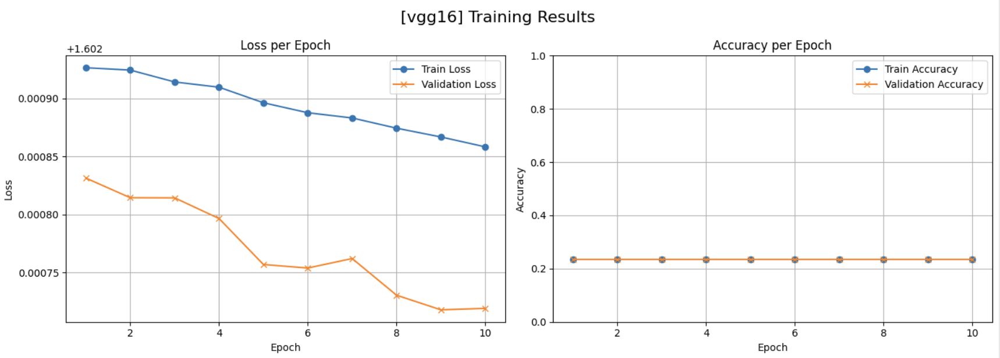
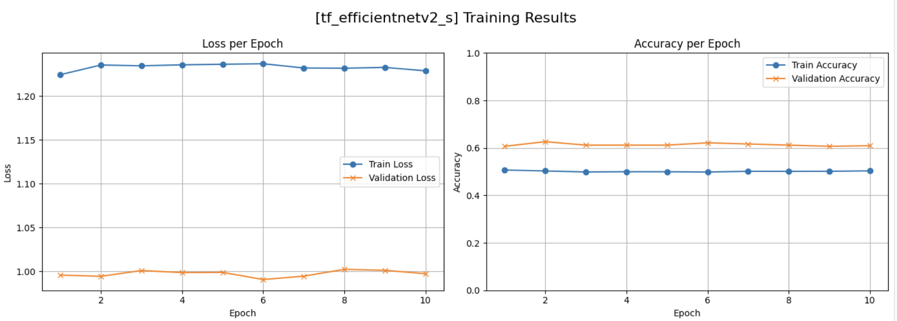

# CNN 및 Transformer 기반 전이 학습을 활용한 꽃 이미지 분류 성능 비교 연구

- 연구자 : ethan.kim (김용범)

## Summary

- CNN 모델과 Transformer 모델을 기반으로 전이 학습을 통해 꽃 이미지를 분류하는 모델 제작
- Kaggle의 꽃 데이터를 학습/검증/평가에 사용
- 모델 별 성능 비교 분석

## 사용한 모델

- CNN 모델
  - VGG16
  - ResNet50
  - EfficientNetV2
  - ConvNeXt (CNN + Transformer)
- Transformer 모델
  - ViT (Vision Transformer)
  - SwinV2

## 데이터셋

- Kaggle 꽃 이미지 ([link](https://www.kaggle.com/datasets/imsparsh/flowers-dataset/data))
- 총 3670개의 학습/테스트용 이미지
- 5개의 클래스 (데이지, 민들레, 장미, 해바라기, 튤립)
- 클래스별 약 500~600개 내외의 데이터

## 데이터 전처리 및 하이퍼파라미터 튜닝

- 모델 별 데이터 전처리/증강 최적화
  - transform 객체를 모델별로 생성
  - 모델별 특징에 맞게 이미지 변환 및 정규화 수행
- Optuna를 사용하여 Learning Rate, Optimizer, Batch Size를 자동 튜닝 하도록 설계.

## 성능 비교 (이미지)

### VGG16

### ResNet50

### EfficientNetV2

### ConvNeXt

### ViT (Vision Transformer)

### SwinV2

## 결론

모든 모델에서 전반적인 성능이 기대 이하

- 학습이 제대로 되지 않은 것에 대한 여러 가능성 검토
  - 코드를 잘못 작성하여 학습이 제대로 이루어지지 않은 경우
  - 데이터 청결도가 좋지 않은 경우
  - 데이터 전처리/증강 방식이 모델 구조에 부적합 할 경우
  - 하이퍼파라미터 설정이 전반적으로 부절절할 가능성 있음
  - 전이 학습 시, 사전 학습 가중치가 제대로 적용되지 않았을 가능성

## 향후 연구 계획

전이 학습 기반 이미지 분류 실험에서 고려해야 할 다양한 변수를 재확인 하는 계기가 되었음. 다음의 항목들에 대해 추가 연구 예정.

- 데이터 품질 향상 및 데이터 전처리 연구
- CNN 및 Transformer 모델 내부 구조 및 동작 원리 분석
- 하이퍼파라미터 튜닝 전략 고도화
- 모델 학습 이력 및 실험 관리 시스템 구축
- 연구 자동화 및 실험 파이프라인 최적화
